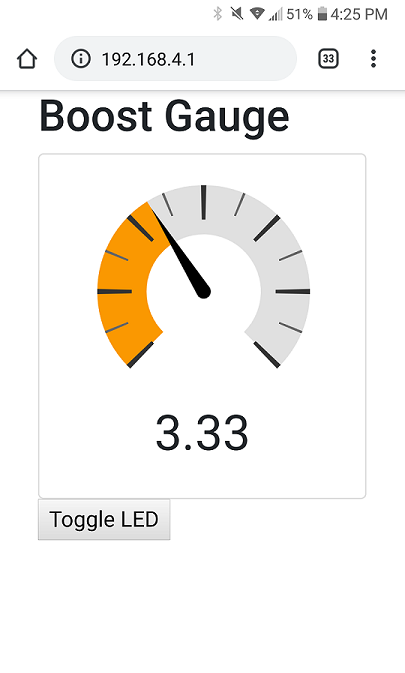

A0 Boost gauge demo  
=======

Sketch for the Macchina A0 that turns it into a web server. Connect to it as a WIFI hotspot, open a webpage and see a Boost gauge!

**Access point name:** A0-BOOST

**Passowrd:** 12345678

http://192.168.4.1

This code borrows heavily from this project and more details for installing required libraries can be found here: 

https://shawnhymel.com/1882/how-to-create-a-web-server-with-websockets-using-an-esp32-in-arduino/

Tested on a 2016 Ford Fiesta

#### License:

This software is MIT licensed:

Copyright (c) 2020 Macchina LLC

Permission is hereby granted, free of charge, to any person obtaining
a copy of this software and associated documentation files (the
"Software"), to deal in the Software without restriction, including
without limitation the rights to use, copy, modify, merge, publish,
distribute, sublicense, and/or sell copies of the Software, and to
permit persons to whom the Software is furnished to do so, subject to
the following conditions:

The above copyright notice and this permission notice shall be included
in all copies or substantial portions of the Software.

THE SOFTWARE IS PROVIDED "AS IS", WITHOUT WARRANTY OF ANY KIND,
EXPRESS OR IMPLIED, INCLUDING BUT NOT LIMITED TO THE WARRANTIES OF
MERCHANTABILITY, FITNESS FOR A PARTICULAR PURPOSE AND NONINFRINGEMENT.
IN NO EVENT SHALL THE AUTHORS OR COPYRIGHT HOLDERS BE LIABLE FOR ANY
CLAIM, DAMAGES OR OTHER LIABILITY, WHETHER IN AN ACTION OF CONTRACT,
TORT OR OTHERWISE, ARISING FROM, OUT OF OR IN CONNECTION WITH THE
SOFTWARE OR THE USE OR OTHER DEALINGS IN THE SOFTWARE.
